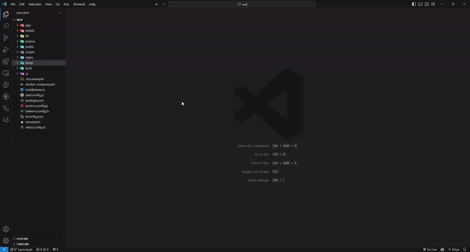
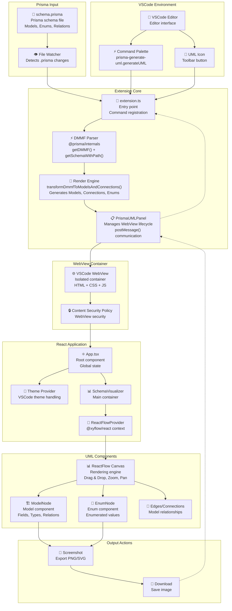

<br />
<p align="center">
    <a href="#" target="_blank"></a>
    <br />
    <br />
    <b>Prisma Generate UML</b> es una extensión de VSCode que crea rápidamente diagramas UML a partir de esquemas de Prisma con un solo clic, ofreciendo una visualización sencilla.
    <br />
    <br />
</p>

> _Puedes descargar los paquetes finales desde la sección de [Releases](https://github.com/AbianS/prisma-generate-uml/releases)._

      

> [!NOTE]
> 🚧
> **Prisma Generate UML** se encuentra actualmente en desarrollo. ¡Mantente atento para más actualizaciones!



## 🏗️ Arquitectura



## 📦 Estructura del Proyecto

```
prisma-generate-uml/
├── packages/
│   ├── prisma-generate-uml/     # VSCode Extension
│   │   ├── src/
│   │   │   ├── extension.ts     # Entry point
│   │   │   ├── panels/          # WebView management
│   │   │   └── core/            # Rendering logic
│   │   └── package.json
│   │
│   ├── webview-ui/              # React Frontend
│   │   ├── src/
│   │   │   ├── App.tsx          # Main component
│   │   │   ├── components/      # UML Components
│   │   │   └── lib/             # Utils and types
│   │   └── package.json
│   │
│   └── schema.prisma            # Example schema
│
├── turbo.json                   # Turbo configuration
└── package.json                 # Root workspace
```

## 🚀 Desarrollo

### Requisitos previos

- Node.js 18+
- npm

### Instalación

```bash
# Clone the repository
git clone https://github.com/AbianS/prisma-generate-uml.git
cd prisma-generate-uml

# Install dependencies
npm install

# Development
npm run dev
```

## ✨ Características

- 🔥 **Diagramas UML Instantáneos**: Genera diagramas UML a partir de esquemas de Prisma con un solo clic
- 🖼 **Visualización Sencilla**: Simplifica la visualización de la arquitectura de datos de manera intuitiva
- 🛠 **Integración Fluida**: Funciona sin problemas dentro de VSCode, sin necesidad de configuración adicional
- 📂 **Soporte para Esquemas de Prisma en Varios Archivos**: Soporte completo para la función `prismaSchemaFolder` de Prisma
- 🔃 **Actualizaciones Automáticas**: Mantén tus diagramas UML actualizados con los cambios en el esquema

## 🏃‍♂️ Uso Rápido

Debes tener instalada la [extensión de Prisma para VSCode](https://marketplace.visualstudio.com/items?itemName=Prisma.prisma) para utilizar esta extensión.

1. Abre un archivo `.prisma` en VSCode
2. Busca el icono de UML en la barra de herramientas del editor
3. Haz clic en él para generar el diagrama al instante

## 🛠️ Tecnologías

- **Extensión**: TypeScript + API de Extensiones de VSCode
- **WebView**: React + Vite + Tailwind CSS
- **Renderizado UML**: React Flow + Componentes Personalizados  
- **Integración con Prisma**: DMMF de @prisma/internals
- **Monorepo**: Turbo + Espacios de trabajo de npm
- **Calidad del Código**: Biome (alternativa a ESLint + Prettier)

## 📄 Licencia

Licencia MIT - consulta el archivo [LICENSE](LICENSE) para más detalles.
