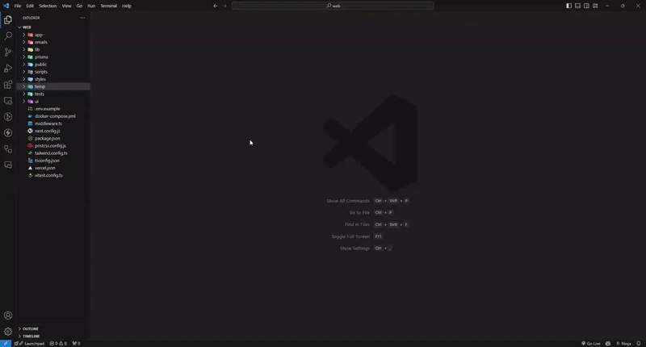
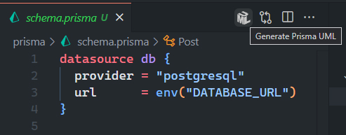

 

    
     
     
    <b>Prisma Generate UML</b> is a VSCode extension that quickly creates UML diagrams from Prisma schemas with a single click, offering easy visualization.
     
     

> _You can download final bundles from the [Releases](https://github.com/AbianS/prisma-generate-uml/releases) section._

     

> [!NOTE]
> 🚧
> **Prisma Generate UML** is currently under development. Stay tuned for more updates!

## ✨ Features

- 🔥 **Instant UML Diagrams**: Generate UML diagrams from Prisma schemas with a single click.
- 🖼 **Easy Visualization**: Simplify data architecture visualization in an exciting way.
- 🛠 **Seamless Integration**: Works seamlessly within VSCode, no extra configuration required.
- 📂 **Multi-file Prisma Schema Support**: We fully support Prisma's `prismaSchemaFolder` feature, allowing you to split your schema into multiple files while still generating a complete UML diagram of your entire database.

## 🔍 What It Does

Get ready to breathe life into your data models! ✨ With our extension, creating UML diagrams from your Prisma files is as easy as it gets.

🚀 When you open your Prisma schema, the UML icon at the top of the editor becomes your magic wand. A simple click, and presto! Your UML model springs to life in an instant.

Say goodbye to boring documentation and hello to the dazzling representation of your database architecture.

Transform your Prisma definitions into a stunning UML diagram with ease and dive into the excitement of data visualization! 🪄💎

## 🚀 How to Use

Generate UML diagrams with a single click:

1. Open your Prisma file.
2. Look for the UML icon at the top of the editor.
3. Click it, and you're done! Your UML diagram will be created instantly.

Simplify data architecture visualization in an exciting way! 🚀

