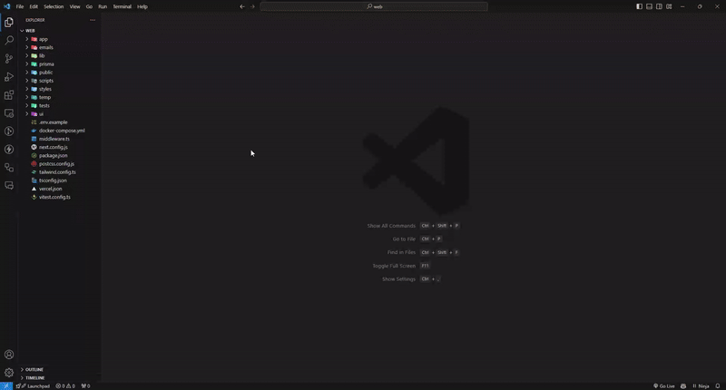

# Prisma Generate UML

Get ready to breathe life into your data models! ✨ With our extension, creating UML diagrams from your Prisma files is as easy as it gets.

🚀 When you open your Prisma schema, the UML icon at the top of the editor becomes your magic wand. A simple click, and presto! Your UML model springs to life in an instant.

Say goodbye to boring documentation and hello to the dazzling representation of your database architecture.

Transform your Prisma definitions into a stunning UML diagram with ease and dive into the excitement of data visualization! 🪄💎

## How to Use

Generate UML diagrams with a single click:

1. Open your Prisma file.
2. Look for the UML icon at the top of the editor.
3. Click it, and you're done! Your UML diagram will be created instantly.

Simplify data architecture visualization in an exciting way! 🚀

